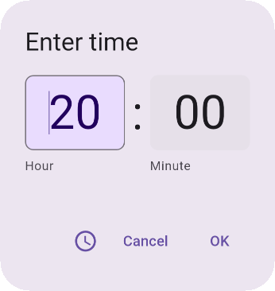

# Keyboard focus walk — `TimePicker/Input`



Eight `Tab` presses through the time-entry form, recorded live. Focus moves
Minute field → OK → dial/keyboard toggle → Cancel and then wraps, so the whole
cycle is visible: this is the component's own focus order, which is not the
order the dialog reads in.

The still frames of the same walk are baked into the catalog by
`@FocusedPreview` (see `docs/evidence/focus-picker-walk/`). This is the moving
version, and unlike the baked stills it is driven through the **live** daemon —
real key events into a held session, not `FocusManager.moveFocus` inside the
renderer.

## Reproducing it

```sh
compose-preview record \
  --module :catalog \
  --preview ee.schimke.m3catalog.sections.TimePickersKt.TimeInputSticker_Light \
  --script demos/focus-keyboard-walk/session.json \
  --out demos/focus-keyboard-walk/time-input-keyboard-walk.gif \
  --fps 12 --scale 0.5
```

Recordings tick on a virtual clock keyed to `fps`, so the same script reproduces
the same frames every run.

## Two things that will waste your afternoon

**`keyCode` is the decimal Android keycode as a string, not the key name.**
`"61"` is Tab. `"TAB"` parses to `null` and is **dropped silently** — the session
still re-renders on every event, so you get a plausible-looking run of frames in
which nothing ever moves. The table is `InteractiveKeyCodes` in compose-ai-tools;
the names in it are `const val Int`, so they are inlined and do not appear in the
compiled constant pool. Do not try to read the supported set out of a jar with
`strings` — it under-reports, and `TAB` is one of the entries it misses.

**A stale `LD_LIBRARY_PATH` reaching the daemon breaks the recording lane.**
In a sandbox where `JAVA_HOME` points at a GL-wrapped JDK, that wrapper exports
`LD_LIBRARY_PATH=…/desktop-gl/lib`, and the daemon subprocess inherits it even
though it launches under a different, correct JVM. A nix glibc then sits in front
of the system one and skiko's native library cannot link, so
`org.jetbrains.skia.Surface` fails class initialisation and `recording/start`
dies. Clear it for the command:

```sh
env -u LD_LIBRARY_PATH JAVA_HOME=/usr/lib/jvm/java-21-openjdk-amd64 compose-preview record …
```

Before compose-ai-tools#5098 this surfaced only as
`recording/start: ExceptionInInitializerError: null`, which names nothing; with
that fix the error reports the linkage failure directly.
