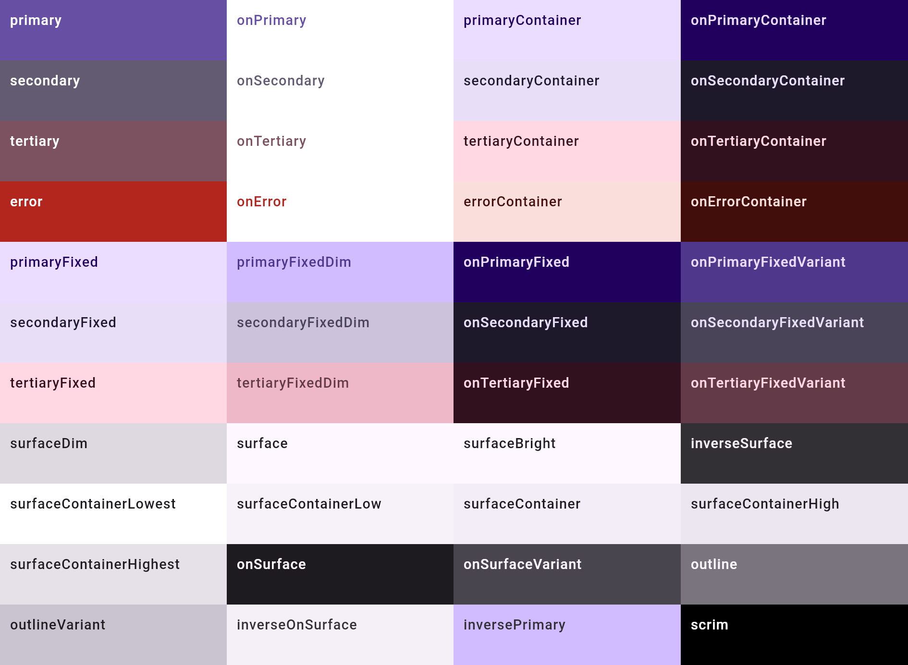
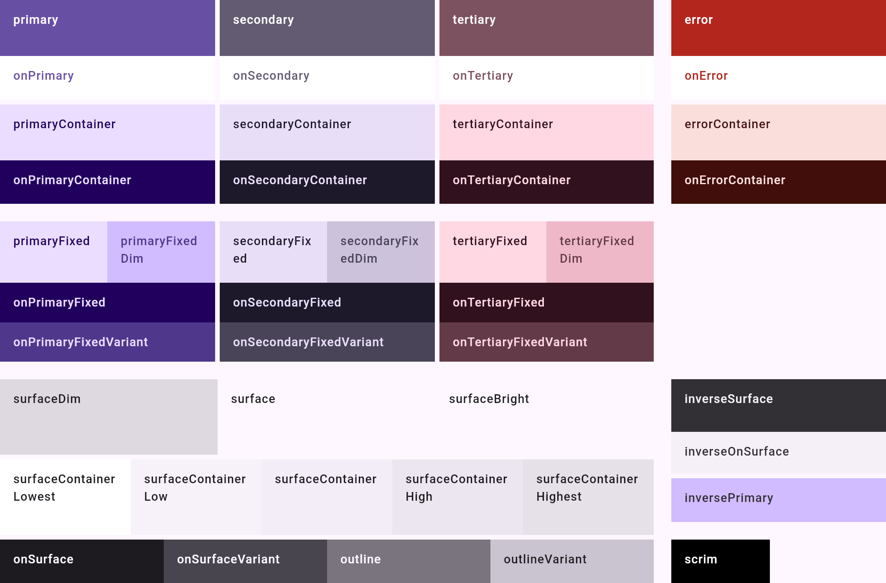

# `Color/Role grid` — schematic layout evidence

Evidence for issue #203: the sticker chunked the 44 colour roles four to a row, which is not a
layout the kit draws anywhere.

## The kit node

`figma:ocdacdEsnHipMJD3egzxKb/53699:35493` ("Schematic group") is two 808x532 scheme blocks side by
side, light and dark. The catalog renders one scheme per variant, so one 808x532 block is the
sticker's bound. Read off the node, that block is:

| Band | Geometry |
| --- | --- |
| top row, 186dp | four 196dp accent columns (primary / secondary / tertiary at 0, 200, 400; error at 612 behind a 16dp gutter), each a 51dp role over a 40dp on-role, a 4dp gutter, then the container pair |
| fixed colours, 128dp | three 196dp columns only — **no error column** — each a 56dp fixed/fixed-dim pair split at 98dp, then two 36dp on-fixed rows |
| bottom row, 186dp | surfaces at 596dp: three 69dp thirds, five 69dp fifths, four 40dp quarters; then a 196dp column of inverse surface (48dp) / inverse on-surface (38dp) / inverse primary (40dp), and the 40dp scrim row |

Every dp above is transcribed from the node's own frames, and `ColorGrid` now spells the same
numbers.

## Before / after

`ColorRoleGridSticker_Light`, rendered by `:catalog:composePreviewRender` at `origin/main` and with
the change.

| Before (#203) | After |
| --- | --- |
|  |  |

The role set is unchanged — the same 44 swatches, the same Compose role names, the same
content-colour pairings. What moved is where they sit.

## What the kit draws and Compose cannot

The kit's `scrim and shadow` row is two 90dp swatches. `ColorScheme` has no shadow role — Compose
draws elevation shadows from the platform rather than from a colour role — so the second slot stays
empty instead of publishing a colour the library does not expose.
