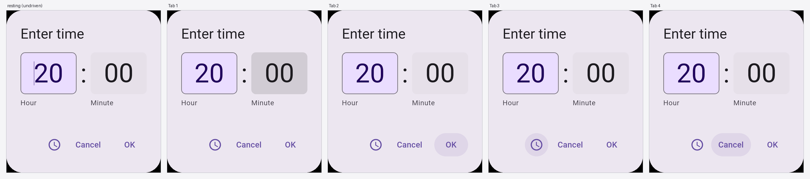
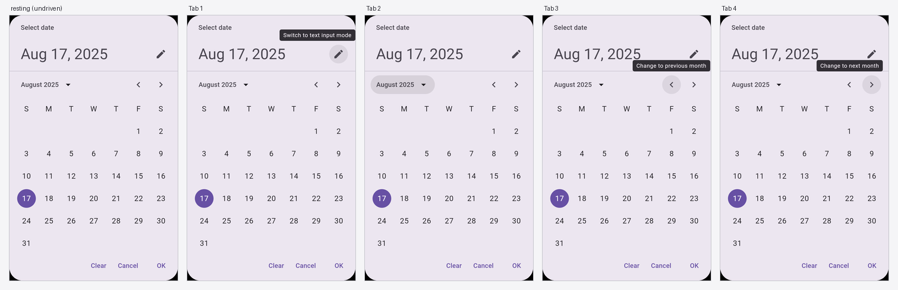

# Baked keyboard walks on the two picker forms

`@FocusedPreview` on `TimePicker/Input` and `DatePicker/Modal`: four
`moveFocus(Next)` steps, one PNG per stop, beside the resting still.

Captured from a **cold** build — `catalog/build/compose-previews` removed,
`--no-build-cache --rerun-tasks` — because an incremental discovery scan carried
focus entries forward across a branch switch and rendered captures for a sticker
whose annotation had been withdrawn. Warm output could not be trusted here.

## `TimePicker/Input`

Resting, then Minute field → OK → dial/keyboard toggle → Cancel. The focus
treatment is the 10% state layer, not the inset ring. Note this is the
component's own focus order, which is not the order the dialog reads in.

## `DatePicker/Modal`

Resting, then the text-input-mode toggle → month dropdown → previous month →
next month, each with its tooltip. Four steps do not reach Clear / Cancel / OK;
that is the picker's own order, not a capture artefact.

## Why these two previews are the proof

Both walks were withdrawn from #277 because of two defects in the renderer,
fixed upstream in [compose-ai-tools#5088] and released in v1.72.0:

1. **A second semantics root took the whole preview down.** `DatePicker/Modal`'s
   dialog composes a second root, and the capture resolved the root by asking
   for exactly one node — `Expected exactly '1' node but found '2' nodes that
   satisfy: (isRoot)`. Every capture of the preview failed, the undriven ones
   included, so the sticker published **no PNG at all**. That it appears here is
   the fix.
2. **A multi-step fan-out replaced the resting capture** instead of joining it.
   The `resting (undriven)` frame on the left of each strip is the fix.

All twenty captures (2 stickers × 2 modes × 5 frames) hash distinct at identical
framing, so every step moved and none reflowed. Both `@OverrideVariant` cells
(`12-hour`, `input`) also carry their resting still plus four steps.

[compose-ai-tools#5088]: https://github.com/yschimke/compose-ai-tools/pull/5088
