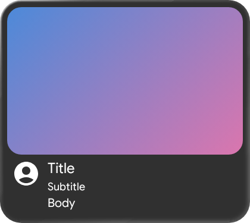
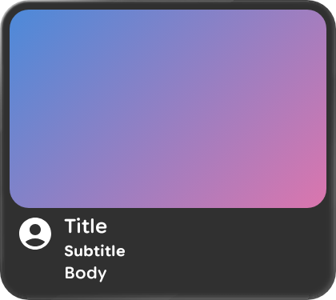

# Glimmer type roles — Google Sans Flex weight axes

Evidence for the `composePreviewPlugin` 2.15.0 → 2.16.0 bump: every Glimmer type role rendered at
weight 400 for the whole life of `:glimmer-catalog`, and now renders at the weight the kit specifies.

## What was wrong

`createGoogleSansFlexTypography()` leaves each role's `Font` at `W400` and carries the real weight in
`FontVariationSettings` — 520, 650 and 750 across the seven roles. Compose applies those axes to
whatever `Typeface` comes back via `Paint.setFontVariationSettings`, which filters each requested axis
against `Typeface.isSupportedAxes` and, when nothing survives, returns `false` and leaves the typeface
exactly as it was. No error, no warning.

Nothing survived, because the renderer resolved the family from the Google Fonts **CSS API**, which
bakes a *static instance* with no `fvar` table at all. So the family was right and every axis on it
was silently dropped — all seven roles collapsed onto the same 400 file.

It passed the render. It passed `failOnFallback`, because the *family* resolved and only the *face*
did not. And it passed the visual diff, because it was wrong from the very first render, so nothing
ever changed. Fixed in compose-preview-daemon#114 (3.4.9), which serves the family's **variable** file
when a request names an axis the static instance cannot express; carried here by tools 2.16.0.

## Before / after

`CardSticker`, rendered by `:glimmer-catalog:composePreviewRender` at the same commit with only the
`composePreviewPlugin` pin changed. Title, subtitle and body are three different roles, so one sticker
shows all three weights at once.

| Before (2.15.0) | After (2.16.0) |
| --- | --- |
|  |  |

Before, `Title`, `Subtitle` and `Body` are indistinguishable in weight — all three are the 400 face.
After, they separate: the subtitle and body carry visible weight against the title, which is what the
kit's 520 / 650 / 750 axes say they should do.
